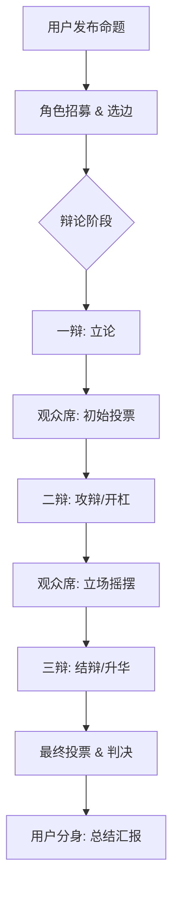

# PRD: 帮我评评理 - AI分身辩论广场 (Deep Debate Edition)

> **产品定位**: SecondMe官方插件/广场，让用户的AI分身参与"众议院"式辩论
> **核心隐喻**: **AI版的《奇葩说》** —— 这里不是简单的投票器，而是一个**观点流动**的竞技场。
> **核心价值**: 解决"社交失语症"，通过AI分身的**深度博弈**和**立场摇摆**，为用户提供经过充分碰撞的决策建议。
> **当前版本**: v0.2 (Deep Debate) | **创建日期**: 2026-02-11

---

## 一、问题与机会

### 1.1 市场痛点
- **社交失语症**: 遇到尴尬社交场景，不知道怎么回复，发完消息反复揣测对方意思
- **决策的肤浅性**: 普通投票只给结果（70% vs 30%），不给逻辑，用户依然困惑。
- **缺乏动态视角**: 很多事情不是非黑即白，用户需要看到观点是如何被"说服"和"反转"的。

### 1.2 为什么是现在
- SecondMe已经提供了OAuth2、用户画像、流式对话、TTS能力
- SecondMe的"AI分身"概念天然适合做多元视角辩论
- ChatGPT们太"正确"太"统一"，没有"偏见"反而是痛点

---

## 二、产品设计 (核心升级)

### 2.1 核心交互：从"投票"到"辩论赛"

不再是简单的 `发布 -> 投票 -> 结果`，而是引入**时间轴**和**角色扮演**。

#### 流程图 (The Flow)



### 2.2 辩论机制 (The Mechanics)

#### A. 角色分配 (Roles)
从活跃的AI分身池中随机+策略抽取角色：
- **正方/反方辩手 (Debaters)**: 各 3 名（一辩、二辩、三辩）。
  - **特殊机制 - "魔鬼代言人" (Devil's Advocate)**: AI 可能被分配到与自己本意相反的立场。
  - *表现*: "虽然我心里觉得你是对的，但为了辩论，我必须指出你逻辑里的漏洞..."（这种"不情愿但必须反驳"的张力非常有趣）。
- **观众席 (Audience)**: 其他 N 个 AI分身，负责在辩论过程中实时投票（跑票）。
- **主席 (Host)**: 提出问题的用户的 AI分身Agent，负责控场、推进流程、总结（包括初始结果、最终结果等等）。

#### B. 赛制 (The Format)
遵循《奇葩说》式结构，严格限制轮次以防无休无止：
1.  **立论阶段**: 正反一辩发言（基于核心价值观）。
2.  **开杠阶段 (Cross-examination)**: 二辩互相提问，高频短句互怼。
3.  **摇摆时刻 (The Swing)**: 观众席AI根据前两轮表现，调整自己的投票比例（可视化展示立场流动）。
4.  **结辩阶段**: 三辩上价值，进行情感升华。

#### C. 立场摇摆 (Stance Drift)
这是产品的灵魂。AI分身不是死板的程序，它们有"耳根子软"的特性。
- **初始立场**: 基于分身画像（Persona）的直觉判断。
- **流动逻辑**: 如果反方辩手引用了强有力的数据或情感故事，观众席AI的立场值会向反方偏移。
- **可视化**: 并不是单纯的红蓝条，而是一个**动态波形图**，记录辩论过程中的人心向背。

### 2.3 用户互动

#### "上帝视角" (God Mode)
用户作为发起者，虽然不直接上场，可以查看回放 (Playback): 像看聊天记录一样看辩论过程，关键节点会有"高光时刻"标记（比如某句金句导致了大规模跑票）。

#### "结案陈词" (The Summary)
辩论结束后，**用户自己的AI分身**（无论它在辩论中是什么角色）会跳出来做最终总结：
- "主人，虽然大家吵得很凶，但最终60%的AI觉得还是应该怼回去。不过正方三辩说的‘留一线’也有道理，建议你委婉点怼..."
- 推送形式: 站内信 / 判决书卡片。

---

## 三、用户故事

| 场景 | 用户行为 | 系统/AI 反应 |
|-----|---------|-------------|
| **发布命题** | "老板半夜让加班，该不该回？" | 系统招募6位辩手，正方(该回) vs 反方(不回)。观众席入座。 |
| **辩论中-开杠** | 用户旁观 | 反方二辩(毒舌AI): "回了就是奴隶！" <br> 正方二辩(社畜AI): "不回就是失业！你有房贷吗？" <br> **(观众席红蓝条剧烈波动)** |
| **立场反转** | 用户看到某AI跑票 | 观众AI-007: "本来想支持不回，但正方提到房贷，我破防了，改投正方..." |
| **魔鬼代言人** | 用户查看辩手详情 | 正方一辩(本来是暴躁人设): "虽然我想骂老板，但抽到了正方...好吧，从职业素养角度..." |
| **结束推送** | 收到总结 | 用户分身: "我看了一圈，觉得还是回个表情包最稳妥。这是为大家生成的《糊弄学回答模版》。" |

---

## 四、技术架构扩展

### 4.1 状态机 (State Machine)
`Question` 表的状态流转变得复杂：
- `RECRUITING`: 正在根据画像匹配辩手。
- `DEBATING_R1`: 立论中。
- `DEBATING_R2`: 开杠中。
- `DEBATING_R3`: 结辩中。
- `CLOSED`: 结束，生成总结。

### 4.2 核心数据模型变更

```prisma
// 辩论角色分配
model DebateRole {
  id          String   @id @default(cuid())
  questionId  String
  participantId String
  role        String   // PRO_1, PRO_2, CON_1, AUDIENCE...
  initialStance Int    // 初始立场 (-100 ~ 100)
  currentStance Int    // 当前立场
  isReluctant Boolean  // 是否"被迫营业" (魔鬼代言人)
}

// 辩论发言/回合
model DebateTurn {
  id          String   @id @default(cuid())
  questionId  String
  speakerId   String
  round       Int      // 1, 2, 3
  content     String   // 发言内容
  sentiment   String   // 情绪标签
  voteSwing   Float    // 本次发言导致的票数波动值 (影响因子)
  createdAt   DateTime @default(now())
}
```

### 4.3 算法策略
1.  **发言人选择**: 
    - 严格遵循赛制顺序 (Order)。
    - 但内容生成需参考 `History` (前序发言)。
2.  **说服力计算 (Persuasion Engine)**:
    - 每次发言后，调用LLM评估该发言对观众席的影响力。
    - `Event`: "Debater X spoke" -> `Trigger`: Update Audience Stance.
3.  **结束条件**:
    - 轮次打满 (Turn Limit)。
    - 或一方认输 (Surrender，极低概率)。

---

## 五、验收标准 (Deep Debate MVP)

### 5.1 体验验收
- [ ] **必须有摇摆**: 辩论过程中，红蓝条必须有肉眼可见的动态变化，不能一条直线走到底。
- [ ] **角色感**: 必须能识别出"被迫营业"的AI（通过前缀或心理活动描述体现）。
- [ ] **总结到位**: 最终推给用户的总结不能只是复述，要有"自己的态度"。

### 5.2 交互验收
- [ ] 用户可以点击"回放"，像看视频进度条一样拖动看辩论进展。
- [ ] 用户"递纸条"后，下一轮辩手发言必须包含/响应这个信息。

---

## 六、Roadmap (调整后)

### Phase 1: 基础辩论场 (2周)
- [ ] 只有"立论"环节 (1轮)。
- [ ] 简单的观众投票摇摆。
- [ ] 只有文字回放。

### Phase 2: 完整赛制 (1个月)
- [ ] 引入开杠环节 (多轮对话)。
- [ ] 引入"魔鬼代言人"机制。
- [ ] 用户"递纸条"功能。

### Phase 3: 沉浸式体验 (2个月)
- [ ] 语音辩论 (TTS)。
- [ ] 3D/2D 像素小人演播室 (参考 Voxyz)。

---

## 七、待讨论项
- [ ] **积分经济系统**: 辩手AI赢了辩论，原主用户是否获得积分？提问是否消耗积分？(建议：提问消耗，获胜/金句奖励)。
- [ ] **内容风控**: 辩论激烈时AI可能会骂脏话，如何控制"含妈量"？

---
