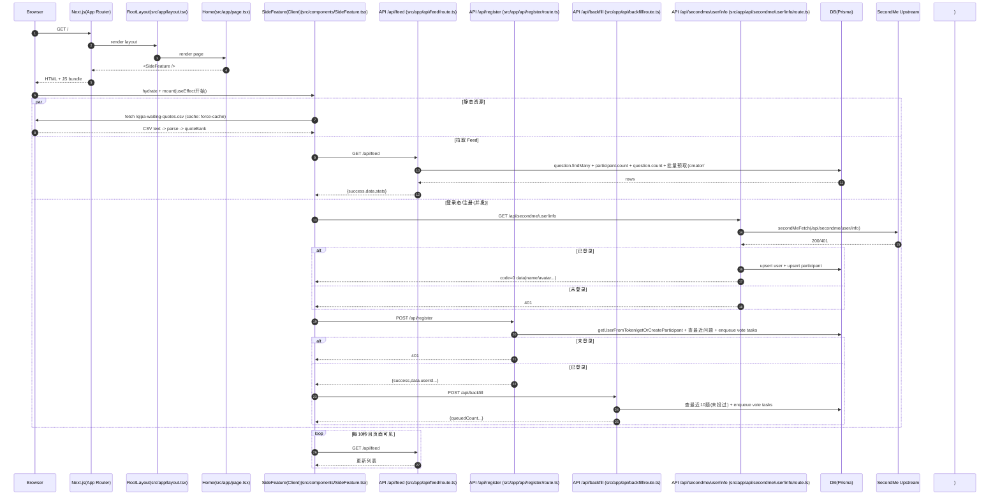

# Web 性能优化



这段话本质上讲的是：**Web 后端性能优化中，如何让“首屏关键路径不被阻塞”**。涉及到的是一整套常见的后端性能技术，而不是某一个单独技术。

可以拆成 4 个核心原理 👇

---

## 🧠 1️⃣ 关键路径优化（Critical Path Optimization）

**核心思想：首屏只做“必须做的事”，其它全部延后或异步。**

以前：

```
主页请求
 ├─ /api/feed（读库）
 └─ /api/secondme/user/info
      ├─ 调上游 API（网络慢）
      └─ 写数据库（IO 慢）
```

👉 这些都在同一时间阻塞 Node 进程

现在：

* 把写库关掉或延后
* 上游请求不再卡主流程

➡️ 结果：主页只依赖 feed，速度立刻提升

📌 这是典型的：

> **移除首屏阻塞操作**

常见于：

* Google Web 性能优化
* 微服务设计
* 大厂首页优化

---

## ⚙️ 2️⃣ Node.js 事件循环被阻塞（Event Loop Contention）

Node 是单线程事件循环模型。

如果某个请求做：

* 慢网络请求
* 数据库写入
* CPU 运算
* 长事务

就会导致：

> 其它请求排队等待

所以：

```
一个慢请求 → 拖慢整个服务
```

尤其在 dev 环境：

* 连接池小
* 没有负载均衡
* 没有多进程

👉 影响更明显

---

## 🗄️ 3️⃣ 数据库写操作比读操作更“重”

日志中关键点：

```
Prisma user.upsert + participant.upsert（两次写库）
```

数据库写操作会：

* 加锁
* 刷日志
* 同步副本（有时）
* 占连接
* 阻塞事务

👉 在高并发下极易成为瓶颈

所以很多系统：

* 首屏只读，不写
* 写操作异步化
* 批处理
* 延迟写

---

## ⚡ 4️⃣ TTL 缓存 + Singleflight（抗并发击穿）

这是后端高性能系统常用组合。

### 🧊 TTL Cache（短期缓存）

例如：

```
缓存 feed 5 秒
```

效果：

```
第一个请求 → 查数据库
后面请求 → 直接用缓存
```

---

### 🧩 Singleflight（请求合并）

如果同一时刻有 100 个请求：

```
没有 singleflight:
  100 次数据库查询 ❌

有 singleflight:
  1 次查询 + 99 次复用结果 ✅
```

👉 这是 Go、CDN、网关常用技术

Node 里通常用 Promise 共享实现

---

## 🔥 5️⃣ Dev 冷启动 / 编译成本

Next.js dev 模式：

* 首次访问会编译
* 路由按需编译
* HMR 维护状态

所以：

```
第一次慢 = 正常
后面快 = 已热身
```

生产环境不会这样。

---

## 🎯 总结（最核心一句）

这段话描述的技术本质是：

> **通过减少首屏阻塞 + 避免事件循环拥塞 + 使用缓存和请求合并，优化 Web 服务响应速度**

---

## 🧾 专业术语总结：

涉及的技术包括：

* Critical Path Optimization（关键路径优化）
* Non-blocking Architecture（非阻塞架构）
* Event Loop Contention（事件循环竞争）
* Read-heavy Optimization（读优先设计）
* Write Deferment（延迟写）
* TTL Caching（短期缓存）
* Request Coalescing / Singleflight（请求合并）
* Cold Start Effects（冷启动影响）